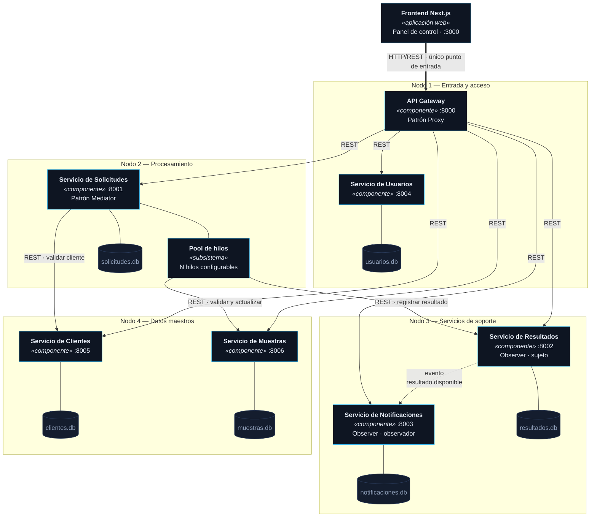

# Figura 1. Diagrama UML de componentes

Corresponde a la Figura 1 del documento de la actividad. Muestra los componentes
de LabCloud Distributed y las interfaces por las que se comunican: REST para las
operaciones que necesitan respuesta inmediata y eventos para las que pueden
ejecutarse de forma desacoplada.

## Lectura del diagrama

| Elemento | Papel en la arquitectura |
|---|---|
| Frontend Next.js | Único consumidor externo. Solo conoce la dirección del Gateway. |
| API Gateway | Punto de entrada; valida el acceso y direcciona cada petición. |
| Servicio de Solicitudes | Concentra el procesamiento concurrente y coordina a los demás servicios. |
| Pool de hilos | Subsistema interno del proceso de Solicitudes; atiende varias solicitudes a la vez. |
| Servicio de Resultados | Registra el informe y emite el evento de disponibilidad. |
| Servicio de Notificaciones | Consume el evento y simula el envío al usuario. |
| Bases de datos | Una por servicio: ningún componente lee la base de otro. |

Las flechas continuas representan comunicación síncrona (REST/HTTP). La flecha
punteada representa comunicación asíncrona basada en eventos: el productor no
espera respuesta del consumidor.
