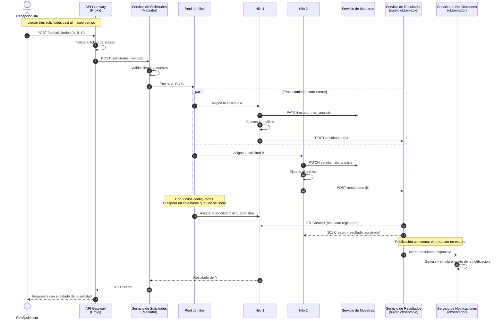

# Figura 2. Diagrama UML de secuencia — procesamiento concurrente

Corresponde a la Figura 2 del documento. Representa la llegada simultánea de
tres solicitudes, su reparto entre los hilos del pool y la notificación
asíncrona posterior.

## Lectura del diagrama

* El **bloque `par`** representa el procesamiento simultáneo: dos hilos avanzan
  al mismo tiempo sobre solicitudes distintas.
* La **nota sobre el pool** refleja la regla descrita en la sección 8.5.1 del
  diseño: las solicitudes que exceden la cantidad de hilos permanecen en cola.
* La **flecha punteada abierta** (`--)`) hacia Notificaciones indica un mensaje
  asíncrono: el Servicio de Resultados responde a quien lo llamó sin esperar a
  que la notificación se entregue. Si el observador estuviera caído, el flujo
  principal terminaría igual y el evento se archivaría para reintento.
