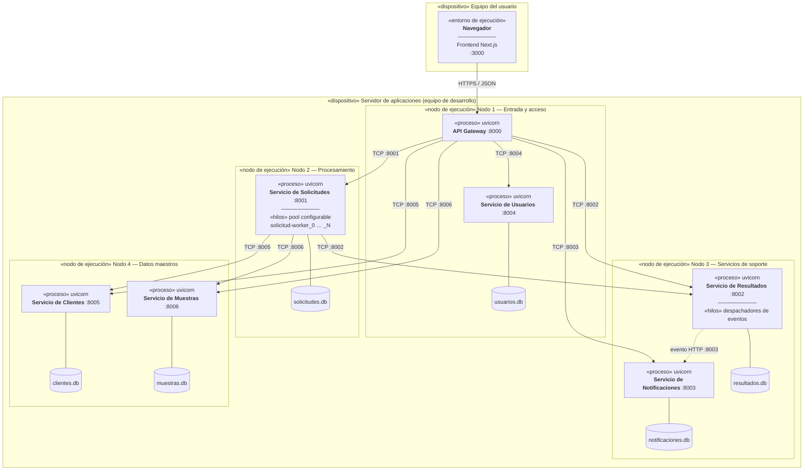

# Figura 3. Diagrama UML de despliegue

Corresponde a la Figura 3 del documento. Muestra cómo se distribuyen los
artefactos del sistema sobre los nodos de ejecución.

En el prototipo académico los nodos se simulan mediante procesos independientes
en puertos distintos del mismo equipo; en un entorno real cada nodo sería una
máquina virtual, un contenedor o un recurso de infraestructura en la nube.

## Correspondencia con un despliegue real

| Elemento del prototipo | Equivalente en producción |
|---|---|
| Proceso `uvicorn` en un puerto | Contenedor o máquina virtual con su propia dirección de red |
| Nodo lógico | Grupo de instancias o *namespace* del orquestador |
| Archivo SQLite por servicio | Instancia de base de datos independiente por servicio |
| Evento HTTP directo | Bus de mensajería (RabbitMQ, Kafka, SNS/SQS) |
| Escalado: aumentar hilos del pool | Réplicas del Servicio de Solicitudes tras un balanceador |

El diseño permite ese tránsito sin cambiar el código: la ubicación de cada
servicio se resuelve mediante variables de entorno (`LABCLOUD_URL_<SERVICIO>`),
de modo que un servicio puede moverse a otra máquina sin tocar a los demás.
